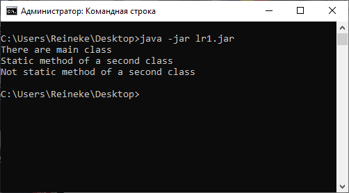

= Отчет по лабораторной работе #1

Студент группы ИВМ-22 Щербаков М.И.

Преподаватель: Петров Н.С.

== Постановка задачи

1. Создать исполняемый java класс, который выводит текстовую строку на экран
2. Разработать два класса. Первый класс вызывает 2 метода из второго класса (статический и нестатический)
3. Создать jar-файл, хранящий элементы из предыдущего задания 

== Разработка задачи

Для выполнения лабораторной работы необходимо создать main-класс,выводящий тестовую строку и вызывающий два метода из второго класса. Во второй класс необходимо добавить два метода: статический и нестатический. Поскольку класс main является статическим, вызов нестатического метода из другого класса выполняется путем создания 
экземпляра класса.

=== Структура проекта

Пакет lr1.jar имеет структуру:

    lr1
       ru
         rsatu
              lr1
                 TextClass.class
                 secondclass.class

== Информация о реализации 

Сначала были созданы необходимые директории. 

Листинг main-класса TextClass:
[,Java]
----
package ru.rsatu.lr1;

public class TextClass {
	public static void main(String[] args)
	{
		System.out.println("There are main class"); //Вывод текстовой строки на экран
		secondclass.StaticText(); //Вызов статического метода из второго класса
		secondclass nonstat = new secondclass(); //Создание экземпляра второго класса
		nonstat.nonStaticText(); //Вызов нестатического метода из второго класса
	}
}
----
Листинг второго класса secondclass:
[,Java]
----
package ru.rsatu.lr1;

public class secondclass {	
	static String text = "Static method of a second class";
		public static void StaticText() { //Статический метод второго класса
		System.out.println(text);
	}
		public void nonStaticText() { //Нестатический метод второго класса
		System.out.println("Not static method of a second class");
	}	
}
----
Создан файл manifest:
[,Java]
----
Manifest-Version: 1.0
Created-By: Scherbakov Maksim
Main-Class: ru.rsatu.lr1.TextClass
----

Компилиция осуществлялась с помощью команды "javac"

[,Java]
-----
javac ru/rsatu/lr1/TextClass.java
-----
Далее генерируется файл .jar с помощью команды 

----
jar cvmf manifest.mf lr1.jar -C ./rsatu ru
----

== Результаты выполнения 

Для проверки работоспособности пакета используется команда

[,Java]
----
java -jar lr1.jar
----
Результат работы программы

== Вывод 

В результате выполнения лабораторной работы получены навыки по созданию классов и пакетов на языке Java.