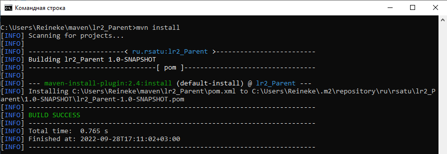
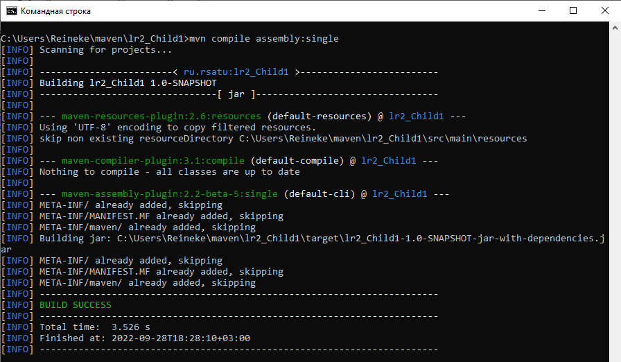
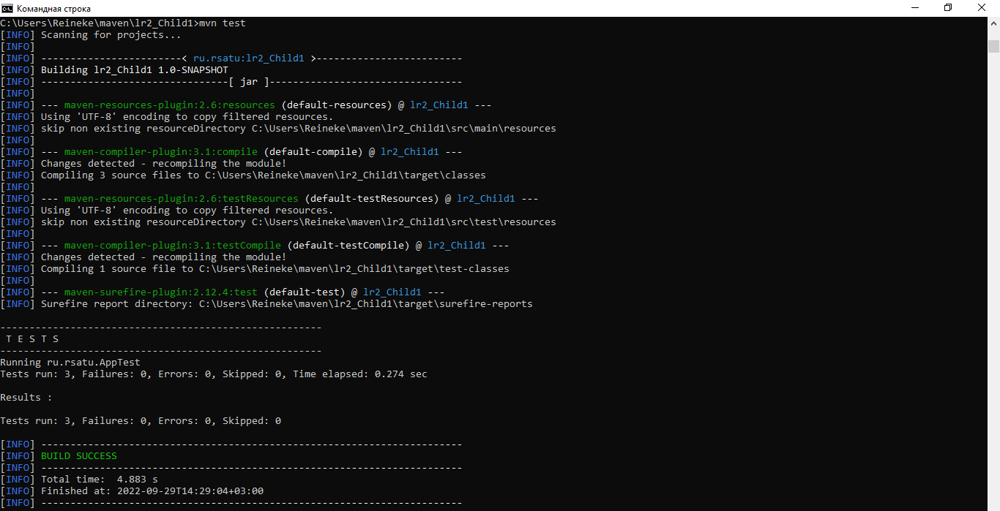
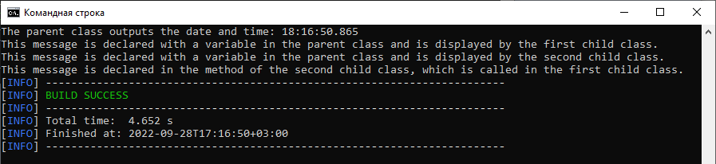
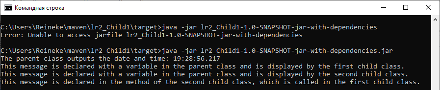

= Отчет по лабораторной работе #2

Студент группы ИВМ-22 Щербаков М.И.

Преподаватель: Петров Н.С.

== Постановка задачи

1. Создать несколько maven-проектов:
* Родительский
* Два дочерних (первый проект зависит от второго)
2. Подключить внешнюю зависимость (из глобального репозитория) в один из проектов и
продемонстрировать работу этой зависимости.
3. Создать maven-проект, который будет помещен в локальный репозиторий. Добавить
этот проект как зависимость в проект из п.1
4. Создать maven-проект, упаковать его в jar-with-dependencies, продемонстрировать рабту
jar. Запустить проект с помощью maven.
5. Выполнить тест подключенной зависимости из п.2 с помощью junit

== Разработка задачи

Для выполнения задания необходимо создать 3 maven-проекта. Был проработан следующий вариант.

Первый проект - родительский - хранит переменные. Эти переменные используют два класса-потомка путем наследования. В свою очередь один из дочерних классов вызывает метод, объявленный во втором дочернем классе. Таким образом осуществляется зависимость классов.

== Реализация

Класс-родитель ParentClass содержит две переменные, которые посредством наследования используют классы Child1 и Child2. Кроме этого к нему подключена внешняя библиотека joda.time, служащая для вывода текущего времени и даты и демонстирующая работу глобальной зависимости.

Класс Child1 выводит текстовое сообщение из переменной класса-родителя путем наследования, а также обращается к методу класса Child2.

Класс Child2 содержит метод, к которому обращается Child1. В этом методе происходит обращение через наследование к переменной класса ParentClass и вывод текстового сообщения.

Если работа программы корректная, то будет выведено следующее сообщение:

----
The parent class outputs the date and time: Wed Sep 28 18:08:27 MSK 2022
This message is declared with a variable in the parent class and is displayed by the first child class.
This message is declared with a variable in the parent class and is displayed by the second child class.
This message is declared in the method of the second child class, which is called in the first child class.

----

=== Листинг

Листинг родительского класса ParentClass следующий:
[,Java]
----
package ru.rsatu;

import org.joda.time.LocalTime; //внешняя библиотека

import ru.rsatu.Child1; 

public class ParentClass {
	public static String Mess = "This message is declared with a variable in the parent class and is displayed by the first child class.";
	public static String Mess2 = "This message is declared with a variable in the parent class and is displayed by the second child class.";
	public static void main(String[] args) {
		LocalTime req_date = new LocalTime();
	    System.out.println("The parent class outputs the date and time: " + req_date);	
	    Child1.MessChild1();
	}
}

----

Листинг класса-потомка Child1 представлен ниже:
[,Java]
----
package ru.rsatu;

import ru.rsatu.ParentClass;
import ru.rsatu.Child2;

public class Child1 extends ParentClass {
   public static void MessChild1(){
	   System.out.println(Mess); //демонстрация наследования
	   Child2.MessChild2(); //построение зависимости от второго класса-потомка 
    }
}

----

Листинг дочернего класса Child2 следующий:
[,Java]
----
package ru.rsatu;

import ru.rsatu.ParentClass;

public class Child2 extends ParentClass{
	
	public static void MessChild2() {
		System.out.println(Mess2); //демонстрация наследования
		System.out.println("This message is declared in the method of the second child class, which is called in the first child class.");
	}
}
----

=== Настройка .pom-файлов

Посредством команды mvn archetype:generate создаются директории проектов с автоматически сгенерированными .pom-файлами.

Один из классов обозначен как родительский. Остальные являются потомками, что прописывается в их .pom следующим образом:

----
  <parent>
	<groupId>ru.rsatu</groupId>
	<artifactId>lr2_Parent</artifactId>
	<version>1.0-SNAPSHOT</version>
  </parent>
----
Один из дочерних классов зависит от второго, что отражается в его .pom как зависимость:

----
  <dependencies>
	<dependency>
	  <groupId>ru.rsatu</groupId>
	  <artifactId>lr2_Child2</artifactId>
	  <version>1.0-SNAPSHOT</version>
	  <scope>compile</scope>
	</dependency>
	
    <dependency>
      <groupId>junit</groupId>
      <artifactId>junit</artifactId>
      <version>4.11</version>
      <scope>test</scope>
    </dependency>
  </dependencies>
----

Содержание .pom родительского проекта следующее:

----
<?xml version="1.0" encoding="UTF-8"?>

<project xmlns="http://maven.apache.org/POM/4.0.0" xmlns:xsi="http://www.w3.org/2001/XMLSchema-instance"
  xsi:schemaLocation="http://maven.apache.org/POM/4.0.0 http://maven.apache.org/xsd/maven-4.0.0.xsd">
  <modelVersion>4.0.0</modelVersion>

  <groupId>ru.rsatu</groupId>
  <artifactId>lr2_Parent</artifactId>
  <version>1.0-SNAPSHOT</version>
  <packaging>pom</packaging>
  
  <name>lr2_Parent</name>
  <!-- FIXME change it to the project's website -->
  <url>http://www.example.com</url>

  <properties>
    <project.build.sourceEncoding>UTF-8</project.build.sourceEncoding>
    <maven.compiler.source>1.7</maven.compiler.source>
    <maven.compiler.target>1.7</maven.compiler.target>
  </properties>

  <dependencies>
  <dependency>
        <groupId>joda-time</groupId>
        <artifactId>joda-time</artifactId>
        <version>2.2</version>
    </dependency>
	
    <dependency>
      <groupId>junit</groupId>
      <artifactId>junit</artifactId>
      <version>4.11</version>
      <scope>test</scope>
    </dependency>
  </dependencies>

  <build>
    <pluginManagement><!-- lock down plugins versions to avoid using Maven defaults (may be moved to parent pom) -->
      <plugins>
		
		<plugin>
			<artifactId>maven-assembly-plugin</artifactId>
			<configuration>
				<archive>
					<manifest>
						<mainClass>ru.rsatu.ParentClass</mainClass>
					</manifest>
				</archive>
				<descriptorRefs>
					<descriptorRef>jar-with-dependencies</descriptorRef>
				</descriptorRefs>
			</configuration>
			<executions>
				<execution>
					<id>make-assembly</id> <!-- this is used for inheritance merges -->
					<phase>package</phase> <!-- bind to the packaging phase -->
					<goals>
						<goal>single</goal>
					</goals>
				</execution>
			</executions>
		</plugin>
       
      </plugins>
    </pluginManagement>
  </build>
</project>

----

== Результаты выполнения 

Результат сборки проектов в репозитории командой mvn install:

Сборка jar-with-dependencies:

Выполнение тестов с помощью JUnit:

Результат выполнения программы в maven:

Результат выполнения программы через запуск .jar:

== Вывод 

Созданы проекты, в которых были реализованы принципы наследования и зависимостей: кроме явной зависимости между двумя проектами, в один из проектов была включена внешняя зависимость. Выполнена сборка maven-проекта, который помещен в локальный репозиторий и добавлен как зависимость к исходному проекту.Maven-проект был упаковать в jar-with-dependencies с демонстрацией его работы.