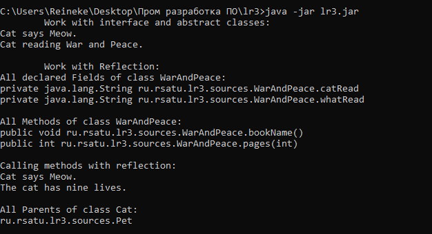
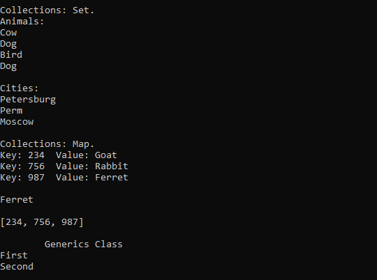

= Отчет по лабораторной работе #3

Студент группы ИВМ-22 Щербаков М.И.

Преподаватель: Петров Н.С.

== Постановка задачи

1. ООП

    1.1 Создать интерфейс
    1.2 Создать абстрактный класс
    1.3 Создать класс, имплементирующий интерфейс
    1.4 Создать класс-наследник абстрактного класса

2. Reflection

    2.1 Выгрузить все поля и методы класса с помощью рефлексии
    2.2 Вызвать несколько методов класса
    2.3 Вывести на экран всех предков класса

3. Collections

    3.1 Ознакомится со всеми коллекциями java (list, set, map) и их реализацией
    3.2 Продемонстрировать в программе работу с каждым видом реализации коллекции (list, set, map)

4. Generics

    4.1 Сделать дженерик на класс
    4.2 Сделать дженерик на метод

== Разработка задачи

=== Интерфейсы, абстрактные классы и методы

В рамках интерфейса Java описываются абстрактные классы. С помощью интерфейса можно указать, что именно должен выполнять класс, его реализующий, но не как это сделать. Способ реализации выбирает сам класс.

В свою очередь абстрактный класс содержит хотя бы один абстрактный метод, т.е. не завершенный метод не имеющий тела.

С помощью таких конструкций можно создавать шаблоны, применяемые в для различных вариантов реализации (например, условный метод "Площадь" может использоваться для вычисления площадей фигур, требующих применение различных формул).

Интерфейс может имплементироваться (реализовываться) классом, а абстрактные классы могут иметь наследников.

=== Reflection

Рефлексия -- это API, встроенное в JAVA, которое позволяет получать информацию о переменных, методах внутри класса, о самом классе, его конструкторах, реализованных интерфейсах, получать новый экземпляр класса, получать доступ ко всем переменным и методам, в том числе приватным, преобразовывать классы одного типа в другой. С одной стороны, это нарушает принципы инкапсуляции. Однако защита от рефлексии может быть обеспечена с помощью класса SecurityManager

=== Java Collections Framework

Коллекции обеспечивают хранение динамического массива данных. Реализованы коллекции за счет интерфейсов. Базовым интерфейсом считается Collection, который, однако, наследуется от интерфейса Iterable. Collection имеет потомков Set, List и Queue. Параллельно с Collection применяется интерфейс Map.

Интерфейс List -- это список или массив, каждый элемент которого имеет индекс. В отличие от стандартного массива, List динамический. Интерфейс имеет несколько реализаций: ArrayList, LinkedList, Vector и Stack.

Set - это набор, множество, реализованное в языке программирования, или коллекция уникальных значений. Ни одно из значений этого множества не повторяется в рамках одного сета. С помощью метода equals() можно проверить наличие (равенство) элемента в наборе. В Set присутствуют реализации HashSet -- сет, внутри которого, кроме объектов, находится хэш-таблица для хранения данных; LinkedHashSet — связанный сет, в котором объекты упорядочены; TreeSet, который хранит свои элементы в виде упорядоченного дерева.

Map не относится к Iterable и представляет собой самостоятельную коллекцию. Map -- это список формата «ключ-значение». Map не итерируется, потому что сложно сказать, какой из ключей можно назвать «первым», а какой «вторым», — это неупорядоченная структура. Интерфейс имеет следующие реализации: Hashtable, HashMap и WeakHashMap. Кроме этого у него есть потомок SortedMap, от которого наследуется еще один интерфейс NavigableMap, который имеет реализацию TreeMap.

=== Generics

Generics -- обобщения, особые средства языка Java для реализации обобщённого программирования, позволяющего работать с различными типами данных без изменения их описания. Generics реализуется с помощью угловых скобок <>. Обобщение осуществлятся на классы и методы, что позволяет избежать ошибок, связанных с типизацией.

=== Структура проекта

Структура проекта следующая 

    lr3.jar
    lr3
        docs
            lr3.adoc
            lr3.pdf
        src
            META-INF
                MANIFEST.MF
            ru
                rsatu
                    lr3
                        CollectionExamples.class
                        CollectionExamples.java
                        GenericClass.class
                        GenericClass.java
                        Main.java
                        Main.class
                        sources   
                            Animal.class
                            Animal.java
                            BigBook.class
                            BigBook.java
                            Cat.class
                            Cat.java
                            Pet.class
                            Pet.java
                            WarAndPeace.class
                            WarAndPeace.java
                        
    

== Информация о реализации 
Интерфейс Pet содержит абстрактный метод voice(). 

[,Java]
----
package ru.rsatu.lr3.sources;

public interface Pet {	//определение интерфейса
	public void voice();    //абстрактный метод интерфейса
} 
----

Этот интерфейс имплементируется классом Cat (который содержит еще один метод для демонстрации рефлексии далее).

[,Java]
----
package ru.rsatu.lr3.sources;

public class Cat implements Pet { 	//класс, имплементирующий интерфейс	
	public void voice() {
		System.out.println("Cat says Meow.");
	}
	public void lives() {
		System.out.println("The cat has nine lives.");
	}
} 
----

Абстрактный класс BigBook содержит абстрактный метод bookName(). 

[,Java]
----
package ru.rsatu.lr3.sources;

public abstract class BigBook {		//абстрактный класс
	public abstract void bookName();
} 
----

От этого класса наследуется класс WarAndPeace, который реализует метод bookName() с помощью двух приватных полей строкового типа. Кроме этого WarAndPeace имеет собственный метод (используется как пример для демонстрации рефлексии в дальнейшем).

[,Java]
----
package ru.rsatu.lr3.sources;

public class WarAndPeace extends BigBook { 	//наследование абстрактного класса
	private String catRead = "Cat reading ";	//приватные переменные
	private String whatRead = "War and Peace."; 
	public void bookName() {
		System.out.println(catRead + whatRead);
	}
	public int pages(int Pages) {
		return Pages;
	}
} 
----

Примеры коллекции представлены классом CollectionsExamples. В нем выполняется работа с некоторыми интерфейсами: List, Set и Map.

[,Java]
----
package ru.rsatu.lr3;
import java.util.ArrayList; //работа с List
import java.util.HashSet; //работа с Set
import java.util.Set;
import ru.rsatu.lr3.sources.Animal;
import java.util.Map;//работа с Map
import java.util.HashMap;

public class CollectionsExamples {
	public void Collections() {
		//Работа с List
		ArrayList<String> SomePersons = new ArrayList<String>(); //создание экземпляра списка
        SomePersons.add("Nikolay");		//добавление элементов в список
		SomePersons.add("Masha");
		SomePersons.add("Max");
		SomePersons.add("Sasha");
		SomePersons.add("Sasha"); //элементы списка могут быть дублированы, но иметь разные индексы
		SomePersons.add(1, "Slava");	//добавляется элемент по индексу 1 (второй элемент списка), сдвиг списка
		System.out.println("Collections: List.");
		for(String person : SomePersons){ //вывод элементов списка
	            System.out.println(person);
	    }
		        		
        SomePersons.set(0, "Alexey"); // элемент 0 заменяется новым
        System.out.println("\nNew element 0: "+SomePersons.get(0));// вывод элемента под индексом 0
          
        System.out.printf("\nArrayList has %d elements: \n", SomePersons.size()); //вывод количества элементов списка
        
        for(String person : SomePersons){ //вывод элементов списка
            System.out.println(person);
        }
       
        // проверяем наличие элемента
        if(SomePersons.contains("Nikolay")){          
            System.out.println("\nArrayList contains Nikolay");
        } else {
        	System.out.println("\nNikolay is missing");
        	if(SomePersons.contains("Alexey")) {
        		System.out.println("Alexey is here\n");	
        	}
        }
          
        // удаление объектов по содержанию
        SomePersons.remove("Alexey");
        // удаление по индексу
        SomePersons.remove(1);
        
        Object[] SomePersonsArray = SomePersons.toArray(); //создание массива объектов
        for(Object person : SomePersonsArray){
          System.out.println(person);
        }
                
        //Работа с Set
        System.out.println("\nCollections: Set. \nAnimals:");
        //хеш-таблица объектов
        HashSet<Animal> someSet = new HashSet<Animal>();
        someSet.add(new Animal("Cow"));
        someSet.add(new Animal("Dog"));
        someSet.add(new Animal("Bird"));
        someSet.add(new Animal("Dog")); //поскольку создан новый экземпляр, это считается за иной объект
        for(Animal anim : someSet){          
            System.out.println(anim.getName());
        }
        
        HashSet<String> cities = new HashSet<String>(); //создание нового списка уникальных элементов
        cities.add("Moscow");
        cities.add("Petersburg");
        cities.add("Perm");
        cities.add("Moscow"); //элементы коллекции Set уникальны, поэтому данный элемент не будет добавлен
        System.out.println("\nCities:");
        for(String a : cities){          
            System.out.println(a);
        }
        
        //Работа с Map
        System.out.println("\nCollections: Map.");
        Map<String, Animal> animalMap = new HashMap<String, Animal>();
        animalMap.put("756", new Animal("Rabbit")); //создание экземпляров с уникальным ключом
        animalMap.put("234", new Animal("Goat"));
        animalMap.put("987", new Animal("Ferret"));
          
        for(Map.Entry<String, Animal> item : animalMap.entrySet()){
          
            System.out.printf("Key: %s  Value: %s \n", item.getKey(), item.getValue().getName());
        }
        
        Animal ferret = animalMap.get("987");	//получение имени элемента по ключу
        System.out.println("\n"+ferret.getName());
        
        Set<String> keys = animalMap.keySet();	//получение ключей элементов
        System.out.println("\n"+keys);                
	}	
} 
----

В классе GenericClass представлен пример типизированного класса и и его типизированного метода.

[,Java]
----
package ru.rsatu.lr3;

import java.util.Collection;

class GenericClass<T> {	//Типизированный класс
	public <E> void GenericMethod(Collection<E> collection) {	//Типизированный метод
		for (E element : collection) {
			System.out.println(element);
		}
	}
} 
----

Reflection и Generic реализованы в классе Main.

[,Java]
----
package ru.rsatu.lr3;

import java.lang.reflect.Field;  //работа с рефлексией - поля
import java.lang.reflect.Method; //работа с рефлексией - методы
import java.util.Arrays;
import java.util.List;

import ru.rsatu.lr3.sources.BigBook;
import ru.rsatu.lr3.sources.Cat;
import ru.rsatu.lr3.sources.Pet;
import ru.rsatu.lr3.sources.WarAndPeace;

import java.lang.reflect.InvocationTargetException; //работа с рефлексией - исключения

public class Main {

	public static void main(String[] args) {
		
		//Работа с интерфейсом и абстрактными классами
		System.out.println("	Work with interface and abstract classes:");
		Pet cat = new Cat();			//создание экземпляров
		BigBook book = new WarAndPeace();	//
		cat.voice();					// вызов методов
		book.bookName();				//
		
		//Работа с рефлексией, выгрузка полей и методов
		System.out.println("\n	Work with Reflection:\nAll declared Fields of class WarAndPeace:");
		Field[] readingFields = book.getClass().getDeclaredFields(); //получение массива private-полей класса WarAndPeace
		for (Field allfield : readingFields) {	//построчный вывод полученного массива
		    System.out.println(allfield);
		}
		System.out.println("\nAll Methods of class WarAndPeace:");
		Method[] readingMethods = book.getClass().getDeclaredMethods(); //получение массива методов класса WarAndPeace
		for (Method method : readingMethods) {	//построчный вывод полученного массива
		    System.out.println(method);
		}
		
		//Вызов методов с помощью рефлексии
		System.out.println("\nCalling methods with reflection:");
		 try {
			 Method callVoice = cat.getClass().getDeclaredMethod("voice"); 	//получение метода класса Cat
			 callVoice.setAccessible(true);									//получение доступа к методу
			 callVoice.invoke(cat);											//вызов метода
			 
			 Method callLives = cat.getClass().getDeclaredMethod("lives");
			 callLives.setAccessible(true);
			 callLives.invoke(cat);
		 } catch (NoSuchMethodException | InvocationTargetException | IllegalAccessException e) { //обработка исключений
			 e.printStackTrace();
		 }	

		 //Вывод предков класса
		 System.out.println ("\nAll Parents of class Cat:");
		 Class<?>   clazz = Cat.class; 
		 Class<?>[] parents = clazz.getInterfaces(); //определение массива предков
		 for(Class<?> parentsList : parents) { 
			 System.out.println (parentsList.getName()); 
		 }
		 
		 //Работа с коллекциями
		 System.out.println ("\n	Collection's examples");
		 CollectionsExamples coll = new CollectionsExamples();
		 coll.Collections();
		 
		 //Работа с Generics
		 System.out.println ("\n	Generics Class");
		 GenericClass<String> generic = new GenericClass<>();
		 List<String> list = Arrays.asList("First","Second");
		 generic.GenericMethod(list);

	}
}
----

Создан файл manifest:
[,Java]
----
Manifest-Version: 1.0
Created-By: Scherbakov Maksim
Main-Class: ru.rsatu.lr3.Main

----

== Результаты выполнения 

После компиляции работоспособность программы проверяется при помощи команды:

[,Java]
----
java -jar lr3.jar
----

Результат работы программы:

image::2.png[]

== Вывод 

В результате выполнения лабораторной работы получены навыки по работе с интерфейсами и абстрактыми классами. 

Были изучены основные интерфейсы Collection и приведениы примеры их использования.

С помощью рефлексии была получена информация о классах и методах, а также о приватных полях. Выполнен вызов метода посредством рефлексии.

Выполнена Generic типизация классов и методов.