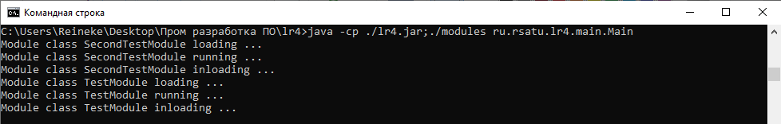
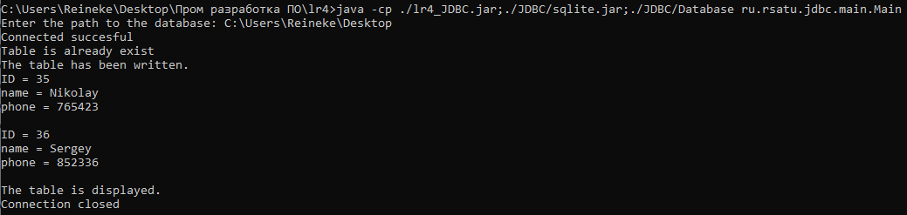

= Отчет по лабораторной работе #4

Студент группы ИВМ-22 Щербаков М.И.

Преподаватель: Петров Н.С.

== Постановка задачи

1. ClassLoader

    1.1 Ознакомится с руководством по загрузке классов и ClassLoader
    1.2 Продемонстрировать работу своего загрузчика классов
    1.3 Определить разницу между своей и стандартной реализацией
    
2. JDBC

    2.1 Установить соединение с БД с помощью JDBC драйвера
    2.2 Создать таблицу БД с помощью JDBC
    2.3 Реализовать CRUD-методы для одной таблицы
    2.4 Реализовать несколько запросов в БД, которые должны выполняться в рамках одной транзакции
    
3. Exception

    3.1 Обернуть методы для работы с БД в try/catch с откатом транзакций и закрытием соединения
    3.2 Продемонстрировать в программе откат транзакции

== Разработка задачи

=== ClassLoader

В  Java реализована модель динамической загрузки классов, позволяющая загружать исполняемый код в JRE не перезагружая основое приложение.

Любой класс изначально запускается каким-либо загрузчиком. Но когда есть необходимость загрузки внешних модулей с определенным поведением при загрузки, либо получения доступа к байт-коду из некоторой базы данных, либо загрузка байт-кода из сети, встает необходимость создания пользовательского ClassLoader.

При проектировании загрузчика за основу был взят пример модульного приложения, в котором реализуется интерфейс. Через интерфейс происходит вызов классов-модулей. Загрузка классов обеспечивается пользовательским загрузчиком классов. Загрузчик - потомок системного ClassLoader'а, переопределяющий метод findClass. Таким образом, загрузчик будет обращаться к модулям из определенной директории, указанной в Main-классе.

=== JDBC и Exception

JDBC (Java DataBase Connectivity — соединение с базами данных на Java) предназначен для взаимодействия Java-приложения с различными системами управления базами данных (СУБД). JDBC основано на драйверах, которые указываются через URL.

В примере выполняется подключение к БД посредством драйвера sqlite. После чего создается таблица, в которую вносятся несколько тестовых записей. Запись осуществляется в пределах одной транзакции (пакета данных), обернутой в метод try/catch. В случае неудачи происходит разрыв соединения. Записи выводятся на экран, и прерывается соединение с БД. 

=== Структура проекта

    lr4.jar
    lr4_JDBC.jar
    docs
        screenshots
        lr4.adoc
        lr4.pdf
    JDBC
        Database
            TestDB.s3db
        sqlite.jar
    modules
        TestModule.class
        SecondTestModule.class
    src
        Module Loader
            modules
                TestModule.java
                SecondTestModule.java    
            lr4
                META-INF
                    MANIFEST.MF
                ru
                    rsatu
                        lr4
                            loader
                                ModuleLoader.class
                                ModuleLoader.java
                            main
                                Main.class
                                Main.java
                            minterface
                                 ModuleInterface.class
                                 ModuleInterface.java
        JDBC
            META-INF
                    MANIFEST.MF
                ru
                    rsatu
                        lr4
                            jdbc
                                main
                                    Main.class
                                    Main.java
                                connect
                                    conn.class
                                    conn.java

== Информация о реализации 

=== ClassLoader (ModuleLoader)

Структура загрузчика классов-модулей следующая:

[,Java]
----
package ru.rsatu.lr4.loader;
import java.io.File;
import java.io.FileInputStream;
import java.io.FileNotFoundException;
import java.io.IOException;
import java.io.InputStream;

public class ModuleLoader extends ClassLoader {  
 
  private String pathtobin; //Путь до директории с модулями
  
  public ModuleLoader(String pathtobin, ClassLoader parent) {
    super(parent);    
    this.pathtobin = pathtobin;    
  }

  @Override	 //переопределение метода findClass стандартного загрузчика через обработку исключений
  public Class<?> findClass(String className) throws ClassNotFoundException {
    try {
      //Получение байт-кода из файла и загрузка класса      
      byte b[] = fetchClassFromFS(pathtobin + className + ".class");
      return defineClass(className, b, 0, b.length);
    } catch (FileNotFoundException ex) {	//обработка исключений
      return super.findClass(className);
    } catch (IOException ex) {
      return super.findClass(className);
    }
    
  }
  
  private byte[] fetchClassFromFS(String path) throws FileNotFoundException, IOException {
    InputStream is = new FileInputStream(new File(path));
    
    // Получение размера файла
    long length = new File(path).length();

    if (length > Integer.MAX_VALUE) {
        System.out.println("File is too large"); //файл слишком большой
      }
    
    // Сохранение полученных данных в массиве
    byte[] bytes = new byte[(int)length];
  
    // Чтение в байтах
    int offset = 0;
    int numRead = 0;
    while (offset < bytes.length
        && (numRead=is.read(bytes, offset, bytes.length-offset)) >= 0) {
      offset += numRead;
    }
  
    // Проверка, что все байты прошли чтение
    if (offset < bytes.length) {
      throw new IOException("The file could not be read: "+path);
    }
  
    // Close the input stream and return bytes
    is.close();
    return bytes;
  }
}
----

Каждый модуль реализует интерфейс:

[,Java]
----
package ru.rsatu.lr4.minterface;
public interface ModuleInterface {
	public static final int EXIT_SUCCESS = 0; //загрузка успешна
	public static final int EXIT_FAILURE = 1; //ошибка загрузки
	public void load();	//загрузка модуля
	public int run(); //исполнение модуля и возвращение результата исполнения
	public void unload(); //выгрузка модуля

}
----

Первый модуль:

[,Java]
----
import ru.rsatu.lr4.minterface.ModuleInterface;
public class TestModule implements ModuleInterface {

	  @Override
	  public void load() {
	    System.out.println("Module " + this.getClass() + " loading ...");
	  }

	  @Override
	  public int run() {
	    System.out.println("Module " + this.getClass() + " running ...");
	    return ModuleInterface.EXIT_SUCCESS;
	  }

	  @Override
	  public void unload() {
	    System.out.println("Module " + this.getClass() + " inloading ...");    
	  }
	}
----
И второй модуль:
[,Java]
----
import ru.rsatu.lr4.minterface.ModuleInterface;
public class SecondTestModule implements ModuleInterface {

	  @Override
	  public void load() {
	    System.out.println("Module " + this.getClass() + " loading ...");
	  }

	  @Override
	  public int run() {
	    System.out.println("Module " + this.getClass() + " running ...");
	    return ModuleInterface.EXIT_SUCCESS;
	  }

	  @Override
	  public void unload() {
	    System.out.println("Module " + this.getClass() + " inloading ...");    
	  }
	} 
----

Содержание Main-класса:

[,Java]
----
package ru.rsatu.lr4.main;

import java.io.File;
import ru.rsatu.lr4.minterface.ModuleInterface;
import ru.rsatu.lr4.loader.ModuleLoader;

public class Main {
  
  public static void main(String args[]) {
    String modulePath = "modules";
    
    //Экземпляр загрузчика модулей
    ModuleLoader loader = new ModuleLoader(modulePath, ClassLoader.getSystemClassLoader());

    //Получение списка доступных модулей
    File dir = new File(modulePath);
    String[] modules = dir.list();
    
    //Загрузка и исполнение модуля
    for (String module: modules) {
      try {
        String moduleName = module.split(".class")[0];
		Class<?> clazz = loader.loadClass(moduleName); 
		ModuleInterface execute = (ModuleInterface) clazz.newInstance();

        execute.load();
		execute.run();
		execute.unload();
        
      } catch (ClassNotFoundException e) {
      e.printStackTrace();
   }    
   catch (InstantiationException e) {
      e.printStackTrace();
    } catch (IllegalAccessException e) {
     e.printStackTrace();
    }	
   }
  }
} 
----

После компиляции происходит вызов Main-класса с указанием classpath ко внешним модулям.Результат работы программы представлен на рисунке ниже:

=== JDBC

Соединение и операции с БД производится через класс Conn:

[,Java]
----
package ru.rsatu.jdbc.connect;

import java.sql.Connection;
import java.sql.DriverManager;
import java.sql.PreparedStatement;
import java.sql.ResultSet;
import java.sql.SQLException;
import java.sql.Statement;
import java.util.Scanner;

public class Conn {
	public static Connection conn;
	public static Statement statmt;
	public static String url;
	public static ResultSet resSet;	
	
	// Подключение к БД
	public static void conn() throws ClassNotFoundException, SQLException 
	   {
		   @SuppressWarnings("resource")
		   Scanner scanner = new Scanner(System.in);
		   
		   System.out.print("Enter the path to the database: ");
		   url = scanner.nextLine();
		   url = "jdbc:sqlite:"+url+"\\TestDB.s3db";	
		     
		   Class.forName("org.sqlite.JDBC");
		   
		   conn = DriverManager.getConnection(url);
		   
		   System.out.println("Connected succesful");
	   }
	
	// Создание таблицы
	public static void CreateDB() throws ClassNotFoundException, SQLException
	   {
		statmt = conn.createStatement();
		
		statmt.execute("CREATE TABLE if not exists 'users' ('id' INTEGER PRIMARY KEY AUTOINCREMENT, 'name' text, 'phone' INT);");
		
		System.out.println("Table is already exist");
	   }
	
	//Заполнение таблицы в пределах одной транзакции
	public static void WriteDB() throws SQLException
	{
		try (Connection conn = DriverManager.getConnection(url)){ 
			
			conn.setAutoCommit(false); //отключение автотранзакций
			   	
			PreparedStatement prepstatmt = conn.prepareStatement("INSERT INTO 'users' (name, phone) VALUES (?, ?)");
			
			prepstatmt.setString(1, "Nikolay");		
			prepstatmt.setInt(2, 765423);
			prepstatmt.executeUpdate();
			prepstatmt.setString(1, "Sergey");
			prepstatmt.setInt(2, 852336);
			prepstatmt.executeUpdate();
			
			System.out.println("The table has been written.");
			conn.commit();
			conn.setAutoCommit(true);			
			}

			catch(Exception ex){
				System.out.println("Connection failed...");//откат транзакции с закрытием соединения
				System.out.println(ex);
				conn.close();
			}
	}
		  
	
	
	//Вывод таблицы 
	public static void ReadDB() throws ClassNotFoundException, SQLException
	   {
			resSet = statmt.executeQuery("SELECT * FROM users");
		while(resSet.next())
		{
			int id = resSet.getInt("id");
			String  name = resSet.getString("name");
			String  phone = resSet.getString("phone");
	         System.out.println( "ID = " + id );
	         System.out.println( "name = " + name );
	         System.out.println( "phone = " + phone );
	         System.out.println();
		}	
		
		System.out.println("The table is displayed.");
	    }
	
		//Закрытие соединения с БД
		public static void CloseDB() throws ClassNotFoundException, SQLException
		   {
			conn.close();
			statmt.close();
			resSet.close();
			
			System.out.println("Connection closed");
		   }
		
		//Удаление таблицы
		public static void DeleteDB() throws ClassNotFoundException, SQLException
		   {
			statmt = conn.createStatement();
			statmt.execute("DELETE FROM users");		
			conn.close();
			System.out.println("Database deleted. Connection closed.");
		   }

}
----

Вызов методов класса производится через Main-класс:

[,Java]
----
package ru.rsatu.jdbc.main;

import java.sql.SQLException;

import ru.rsatu.jdbc.connect.Conn;

public class Main {

	public static void main(String[] args) throws ClassNotFoundException, SQLException {
		
		Conn.conn(); //соединение
		Conn.CreateDB(); //создание таблицы
		Conn.WriteDB(); //заполнение таблицы (CRUD)
		Conn.ReadDB(); //чтение таблицы (CRUD)	
		Conn.CloseDB(); //закрытие соединения
		
	}
}
----

Задается classpath (для работы программы необходимо соединение с драйвером sqlite) и путь к тестовой базе данных. Результатом вывода программы будет следующее:

== Вывод 

В результате выполнения работы был создан пользовательский загрузчик классов, с помощью которого реализовано модульное приложение. При создание загрузчика был переопределен метод findClass стандартного ClassLoader'а.

Кроме этого, было создано JDBC-приложение. Выполнено подключение к сторонней базе данных, внутри нее создана и заполнена тестовая таблица users. Реализованы CRUD-методы, выполнена запись и чтение данных из таблицы. Выполнено обращение к БД в пределах одной транзакции. Методы для работы с транзакцией обернуты в блок try/catch с откатом транзакций. 